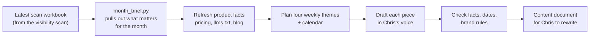

# StoryChatPro Content Planner

A reusable Claude skill that turns the StoryChatPro visibility scan into **a month of draft marketing content**: a calendar, blog posts, a newsletter issue, and LinkedIn, Instagram and Reddit posts, plus ad concepts. Each piece is based on a finding from the scan and written in co-founder Chris Riley's voice for him to rewrite.

> **To run it:** say **"Plan StoryChatPro content for [month]"** and attach your latest scan workbook (`storychatpro-scan-YYYY-MM-DD.xlsx`).

Built by Melissa Forte, co-founder of StoryChatPro. It is the second half of a pair: the [StoryChatPro Visibility Scan](#how-it-connects-to-the-visibility-scan) finds out what's happening, and this skill turns that into content.

---

## Why this skill exists

StoryChatPro is an AI screenwriting coach built on one promise: **the AI never writes for the writer.** That creates a problem for its own marketing, because content that reads as AI-written breaks that promise with exactly the writers it's trying to reach.

So this skill does the parts AI is good at and leaves the voice to a person:

- **It reads the research:** what writers search for, what they distrust about AI, what feedback costs, and when contest deadlines fall.
- **It plans:** four weekly themes, each tied to a finding, laid out in a calendar.
- **It drafts** every piece in Chris's voice, with **marked gaps** wherever a real story of his belongs.
- **It never** posts, invents a story or testimonial, or uses a number it can't source.

## What it produces

One shared document (or a Word file if shared docs aren't available) containing:

| Part | What's in it |
|---|---|
| **How to use this packet** | Three lines on filling the gaps and checking before posting |
| **The month at a glance** | Four weekly themes and the scan finding behind each |
| **Calendar** | Every piece with its date, channel and a Status column (Draft for Chris, Chris rewriting, Ready to post, Posted) |
| **Drafts, by week** | Each piece with a **Based on** line naming its scan finding, the draft, its sources, and `[CHRIS: …]` gaps |
| **Ad concepts** | Two concepts to test later, with headline, text, image idea and audience |
| **Sources** | Every page the numbers come from |

The default month is **2 blog posts, 1 newsletter, 4 LinkedIn posts, 4 Instagram carousels, 2 Reddit posts and 2 ad concepts.** Ask for a different mix, audience or voice and it follows that instead.

## How it works



1. **Build the brief.** A small Python script reads the scan workbook and lists, for the chosen month: deadlines open, closing and coming up; search questions where StoryChatPro is missing; what writers say about AI; prices; the cost comparison; lists worth pitching; and the scan's recommended actions.
2. **Refresh the product facts** from storychatpro.com (pricing, llms.txt and the blog), so drafts use current prices and don't repeat existing posts.
3. **Plan** four weekly themes, one per finding, and lay them out in a calendar that avoids holidays.
4. **Draft** each piece following the channel playbook and the voice guide.
5. **Check** every draft: numbers traced to a source, unconfirmed deadlines worded as "typically" or "last cycle," no invented stories, correct brand name, Reddit posts useful and disclosed, and no competitor names in ads.
6. **Deliver** one document with the calendar first and the drafts grouped by week.

## What's inside the skill

```
storychatpro-content-planner/
├── SKILL.md                          Instructions Claude follows, step by step
├── references/
│   ├── voice-and-brand.md            Chris Riley's voice, brand naming rules, product facts, honesty rules
│   ├── channel-playbook.md           Format and length for each channel: blog, newsletter, LinkedIn, Instagram, Reddit, ads
│   └── findings-to-content.md        How each kind of scan finding becomes content, and how to build the month
└── scripts/
    └── month_brief.py                Reads the scan workbook and writes the month's brief
```

The skill combines **instructions** (the `.md` files), which tell Claude how to plan and write, with a **script** (the `.py` file), which pulls the same facts out of the scan the same way every time.

## How it connects to the visibility scan

| | StoryChatPro Visibility Scan | StoryChatPro Content Planner |
|---|---|---|
| **Question** | Can writers find us, and what's the market doing? | What should we say this month, and when? |
| **Run it with** | "Run my StoryChatPro visibility scan" | "Plan StoryChatPro content for [month]" |
| **Produces** | A dashboard and a scan workbook | A content document with a calendar and drafts |
| **Feeds** | The content planner, through the workbook | Chris's edits, then posting |

A good monthly rhythm: run the scan, then plan the next month's content from that scan's workbook.

## The rules it follows

- **Drafts, not posts.** Nothing is posted, scheduled or sent.
- **Craft earns the mention.** About two thirds of the pieces teach or inform. About one third are about StoryChatPro.
- **Lead with the mentor path.** Other tools now also promise "AI won't write for you." StoryChatPro's clearer difference is that a script scoring 7.5 or higher unlocks a session with a human mentor.
- **Never invent.** No made-up anecdotes, quotes, testimonials, user counts or numbers. Gaps are left for Chris.
- **Brand names:** "StoryChatPro" (one word) for the platform and company. "Script Whisperer" (two words) for the AI tool inside it.

## First run (September 30, 2026)

The first run planned November 2026 from the September 30 scan and produced 15 drafts for contest and fellowship writers, around four weekly themes:

1. Honest feedback beats flattering feedback
2. What feedback costs now
3. Contest season starts in January
4. Spend on a human when it counts

The schedule was later moved to start October 11, with week 4 held for a StoryChatPro screenwriting competition launching in the first week of November.

## Limits

- **The drafts are only as current as the scan.** Run a fresh scan before planning a new month.
- **Reddit rules can't be checked automatically,** because the tools can't open Reddit. Read each subreddit's rules before posting.
- **Chris's voice is modeled on his course material,** not on his personal writing, so every draft needs his rewrite to sound fully like him.
- **Ad concepts are ideas to test,** not tested ads. Run them only after organic posts show which message lands.
