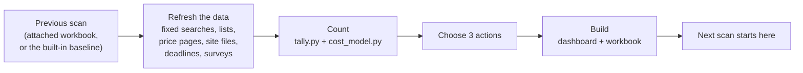

# StoryChatPro Visibility Scan

A reusable Claude skill that checks, in one sentence, whether screenwriters looking for script feedback can find **StoryChatPro**, and how it compares with the alternatives they find instead.

> **To run it:** say **"Run my StoryChatPro visibility scan."**
> For a comparison with last time, attach the workbook from your last scan.

Built for Week 6 of Applied AI Foundations ("Build a Research Skill") by Melissa Forte, co-founder of StoryChatPro.

---

## Why this skill exists

StoryChatPro is an AI screenwriting coach built around one promise: **the AI never writes for the writer.** It gives Socratic feedback, scores the script, and unlocks an hour with a human mentor once a script reaches 7.5.

As the platform starts marketing, the founders need honest answers to a few questions:

1. When writers search for script feedback, **who shows up, and does StoryChatPro?**
2. Which **"best AI screenwriting tools" lists** exist, and who is on them?
3. What do the **alternatives cost**: AI coaches, general AI (ChatGPT, Claude), AI coverage, human coverage and mentorship?
4. When are the major **contest and fellowship deadlines**, the moments writers most want feedback?
5. What are **writers saying about AI**, and how big is the market for paid human feedback?

The answers change every month as lists get published, prices move and contests post new dates. The skill asks the same questions the same way every time, so each run can be compared with the last.

## What it accomplishes

Each run produces three things:

| Output | What it is |
|---|---|
| **Dashboard** | A one-page report with headline numbers, three next actions, and panels for search results, best-of lists, a feedback cost comparison, website health, the application calendar, a price map, market size and writer sentiment |
| **Workbook** (`storychatpro-scan-YYYY-MM-DD.xlsx`) | Every table from the scan in one Excel file. It's the scan's memory: attach it next time and the new dashboard lists what changed |
| **Short summary** | The biggest change since last time, the top action, and anything that couldn't be checked, with sources |

It also checks whether search engines and AI tools can read storychatpro.com. The addresses checked are `llms.txt`, `sitemap.xml` and `robots.txt`, the three small files that tell crawlers what a site is.

## How it works



1. **Load the previous scan** from an attached workbook. If none is attached, the skill uses the built-in baseline from September 30, 2026.
2. **Refresh the data.** It reruns the same 9 web searches, rechecks the best-of lists, price pages, contest pages and site addresses, and adds new surveys or reporting.
3. **Count.** Small Python scripts tally the results, work out what changed since the last scan, and run the cost comparison.
4. **Choose three actions** based on what the numbers show.
5. **Build** the dashboard and the workbook.

## What's inside the skill

```
storychatpro-visibility-scan/
├── SKILL.md                      Instructions Claude follows, step by step
├── references/
│   ├── search-plan.md            The exact searches, pages and columns to use each run
│   └── reading-the-results.md    How to interpret results, choose actions, write the summary
├── scripts/
│   ├── tally.py                  Counts results and lists what changed since the last scan
│   ├── cost_model.py             Compares what one script's feedback costs by each path
│   ├── build_dashboard.py        Turns the data into the one-page dashboard
│   └── workbook.py               Saves a scan to Excel, or loads a past one back in
├── assets/
│   └── dashboard_template.html   Dashboard design (StoryChatPro brand colors and type)
└── data/                         The first scan (Sept 30, 2026), used as the baseline
    ├── search_visibility.csv     63 writer-search results + 16 brand-search results
    ├── best_of_lists.csv         10 "best AI screenwriting tools" lists
    ├── prices.csv                29 prices, from AI coaches to human mentorship
    ├── site_check.csv            5 storychatpro.com addresses and what each serves
    ├── deadlines.csv             19 contests, fellowships and labs
    ├── sentiment.csv             11 findings on how writers see AI
    ├── market_size.csv           Market-size clues with their sources and years
    ├── actions.csv               The three recommended next steps
    └── settings.json             Plan prices, $200 mentor hour, cost-model cases
```

The skill mixes **instructions** (the `.md` files), which tell Claude what to do, with **scripts** (the `.py` files), which do the counting the same way every run.

## What the first scan found (September 30, 2026)

- StoryChatPro appeared in **0 of 63** results for questions writers type, and on **0 of 10** best-of lists.
- **llms.txt, sitemap.xml and robots.txt all served the login page**, so search engines and AI tools couldn't read the site properly. This is the first fix.
- **76%** of search results and **7 of 10** lists came from companies selling their own tools.
- Three competitors now also promise AI that doesn't write for you: Better Draft ($35/mo), ScriptFlo ($30/mo) and Scriptlaunch ($14.99/mo). **None offers a path to a human mentor.** That path is StoryChatPro's clearest difference.
- **Cost model, middle case:** human-only feedback on one script costs about **$600** (3 coverage reports). StoryChatPro plus one mentor hour costs **$236–$305**, roughly half.
- Contest and fellowship applications peak in **April and May**. A smaller fall season runs October to November.
- The one hard number on paid human feedback: the Black List performed about **25,600 paid evaluations a year** over the last five years.

## Limits

- Results come from **one search engine on one day**, and they vary by person and location.
- The scan shows the web pages AI tools draw from, **not ChatGPT's actual answers.**
- The cost comparison is a **model with stated assumptions**, not measured spending. The assumptions can be changed in `settings.json`.
- No public source reports how many writers pay for human coverage or mentorship. Market numbers are clues from different years that count different things, so they shouldn't be added together.
- Vendor statistics are labeled as vendor claims, and the skill never estimates a missing number.

## Sources used in the first scan

Main sources: StoryChatPro's pricing page; competitor sites and reviews (Better Draft, ScriptFlo, No Film School); coverage price roundups (StoryNotes, OnDesk); official contest and fellowship pages (PAGE Awards, Austin Film Festival, Final Draft Big Break, the Academy's Nicholl Fellowships, Sundance, Disney, Writers Guild Foundation); the Black List's evaluation data; the Authors Guild and Ellipsus writer surveys; and Data USA. Every row in the data files keeps its source URL.
